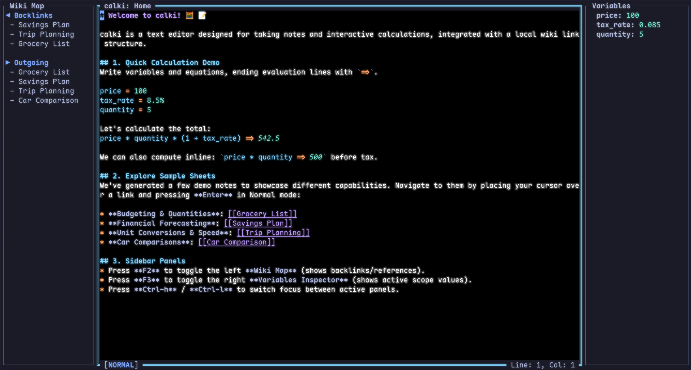
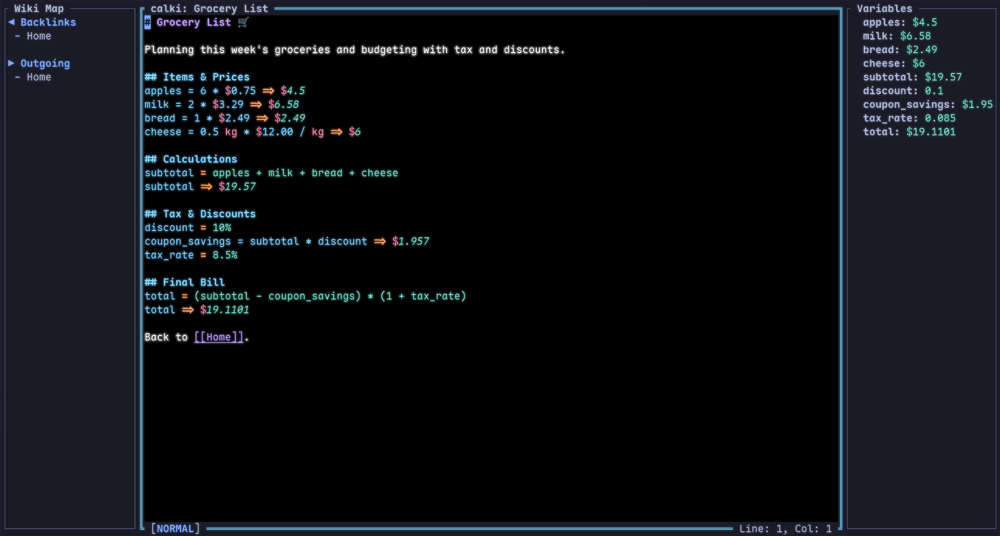
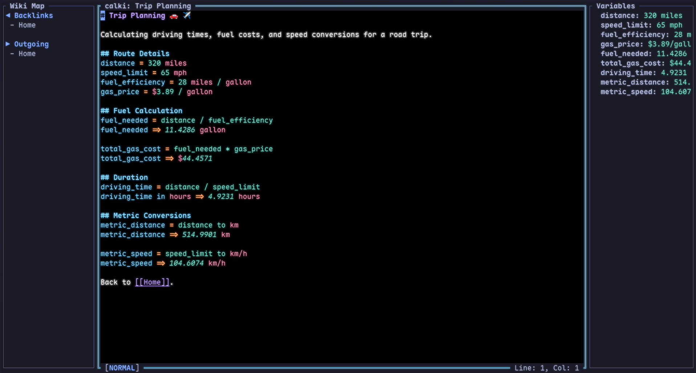

# calki 🧮 📝

A terminal-based Markdown note-taking tool and interactive math sheet calculator with local wiki-style link navigation.

`calki` combines real-time document-based calculations with the inter-linked organization of a personal wiki, all inside a fast, Vim-friendly terminal interface.



---

## 🚀 Key Features

* **Interactive Math Sheets**: Real-time evaluation of mathematical equations. Write assignments or expressions, end them with `=>`, and watch them calculate instantly when you exit Insert mode.

  

* **Inline Math Evaluation**: Run calculations right inside your sentences using backticks: `` `10m * 5m => 50m^2` ``.
* **Dimensional & Currency Analysis**: Supports physical units (length, speed, data size, temperature, time) and live-updated currency conversion (fetched via a background thread to prevent startup latency).

  

* **Wiki Link Navigation**: Create double-bracket links like `[[Project Goals]]` to connect notes. Press `Enter` on a link in Normal mode to jump to it, and `Backspace` or `Ctrl-o` to navigate back.
* **Triple-Panel Layout**:
  - **Left Panel (Wiki Map)**: View references and incoming backlinks for the current note.
  - **Center Panel (Editor)**: Full-featured editor powered by `edtui` with Vim motion bindings.
  - **Right Panel (Variables Inspector)**: View active variable scopes and mathematical evaluations.
* **Persistent Session & Customization**: Automatically saves your panel layout, cursor position, and preferences (such as `scrolloff` vertical viewport margins) in `~/.config/calki/config.json`.

---

## 🛠️ Installation

### Prerequisites

To compile and run `calki`, you will need the Rust toolchain installed on your machine. If you do not have it, install it via [rustup](https://rustup.rs/):

```bash
curl --proto '=https' --tlsv1.2 -sSf https://sh.rustup.rs | sh
```

### Build from Source

1. Clone the repository:
   ```bash
   git clone https://github.com/kemika180/calki.git
   cd calki
   ```

2. Build the release binary:
   ```bash
   cargo build --release
   ```

3. (Optional) Install the binary to your Cargo binary path:
   ```bash
   cargo install --path .
   ```

4. Run `calki`:
   ```bash
   # If installed via cargo path:
   calki

   # Or run the release binary directly:
   ./target/release/calki
   ```

---

## ⌨️ Keybindings & Navigation

`calki` uses Vim-like modal editing. You can navigate the editor using standard Vim motions (`h`, `j`, `k`, `l`, `w`, `b`, etc.).

### Panel Controls
| Key | Action |
| --- | --- |
| `F2` | Toggle Left Panel (Wiki Map) |
| `F3` | Toggle Right Panel (Variables Inspector) |
| `Ctrl-h` | Move focus to the panel on the left |
| `Ctrl-l` | Move focus to the panel on the right |

### Help & Reference Modals (Normal Mode)
| Key | Action |
| --- | --- |
| `~` (tilde) | Toggle General Help Modal |
| `F1` | Toggle Mathematical Function Guide Modal |

### Wiki Navigation (Normal Mode)
| Key | Action |
| --- | --- |
| `Enter` | Follow `[[Wiki Link]]` under the cursor / Create note |
| `Backspace` or `Ctrl-o` | Go back to the previous note in history |

### Editor Actions (Visual Mode)
| Key | Action |
| --- | --- |
| `Enter` | Wrap the highlighted selection in a `[[Wiki Link]]` |

---

## ⚙️ Configuration

`calki` stores configuration files in your OS-appropriate configuration directory (typically `~/.config/calki/` on Linux/macOS).

The `config.json` file supports customization of parameters like `scrolloff` (the number of lines to keep visible above and below the cursor when scrolling):

```json
{
  "scrolloff": 5
}
```

---

## 📄 License

This project is licensed under the GPL v3 License. See the [LICENSE](LICENSE) file for details.
