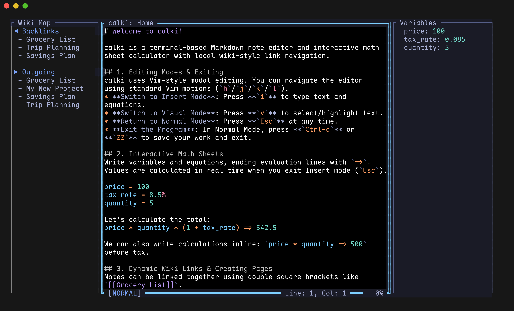
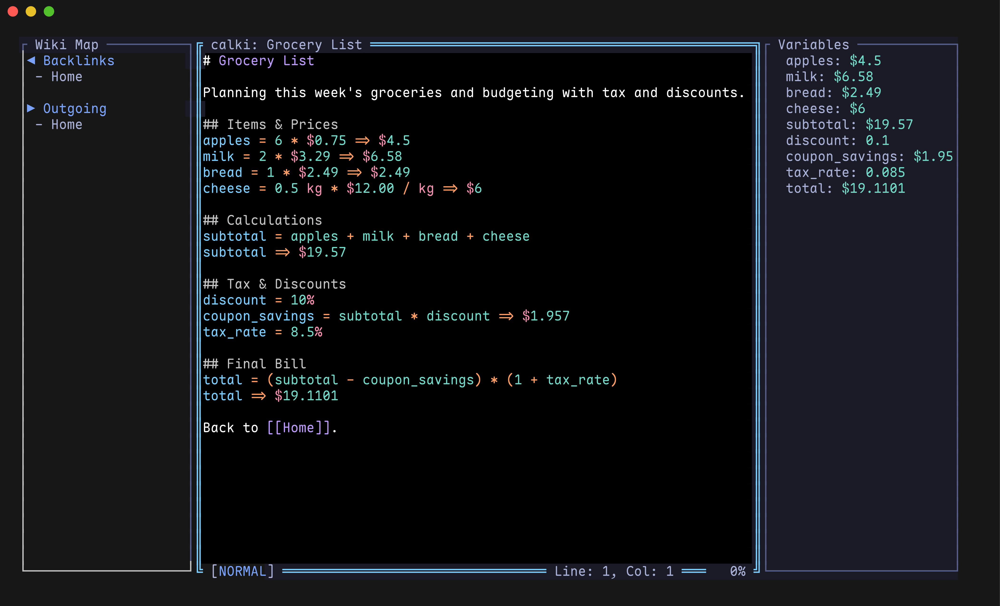
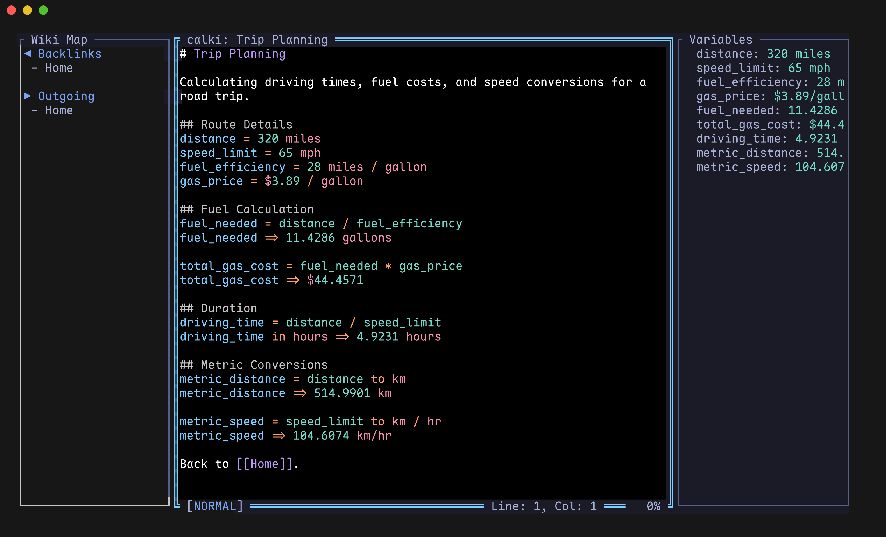

# calki 🧮 📝

A terminal-based Markdown note-taking tool and interactive math sheet calculator with local wiki-style link navigation.

`calki` combines real-time document-based calculations with the inter-linked organization of a personal wiki, all inside a fast, Vim-friendly terminal interface.



---

## 🚀 Key Features

* **Interactive Math Sheets**: Real-time evaluation of mathematical equations. Write assignments or expressions, end them with `=>`, and watch them calculate instantly when you exit Insert mode.

  

* **Inline Math Evaluation**: Run calculations right inside your sentences using backticks: `` `10m * 5m =>` ``.
* **Powerful Calculation Engine**: Far beyond basic arithmetic — trigonometry, statistics (`mean`, `median`, `stddev`, `variance`), vectors and **matrices** (`[[1, 2], [3, 4]]` with `*`, `transpose`, `det`, `inv`, and linear systems via `linsolve(A, b)`), complex numbers, symbolic differentiation (`diff`) and equation solving (`solve` — symbolic rearrangement, algebraic inversion, or Newton-Raphson with an optional initial guess for nonlinear equations), higher-order list operations (`map`, `filter`, `reduce`, `zip`), `for`/`while` loops and conditionals, financial functions (`pmt`, `fv`, `pv`), hex/binary literals, and inline `sparkline`s.
* **Dimensional & Currency Analysis**: Supports physical units (length, speed, data size, temperature, time) and live-updated currency conversion (fetched via a background thread to prevent startup latency).
* **Date, Time & Timezones**: Native date/time values (`2026-08-01`, `2026-08-01T09:30`, `9am`, `9:30pm`) with calendar-aware arithmetic — `2026-08-01 + 3 days`, `2026-08-04 - 2026-08-01 => 3 days`, `2024-01-31 + 1 month => 2024-02-29` (leap-safe, end-of-month clamping) — plus DST-correct timezone conversion (`9am PST in UTC`, `2026-07-01T09:00 in America/New_York`; IANA names, common abbreviations, and `UTC±N` offsets) and `now()` / `today()`.
* **Export**: Compile the current note to HTML, or the entire wiki to a single Markdown document (`Ctrl-e`).

  

* **Wiki Link Navigation**: Create double-bracket links like `[[Project Goals]]` to connect notes. Press `Enter` on a link in Normal mode to jump to it, and `Backspace` or `Ctrl-o` to navigate back.
* **Header Section Folding**: Collapse long notes by section. Press `za` or `Tab` on a Markdown header (`#`, `##`, …) to fold or unfold everything beneath it down to the next header of the same level, shown as a `▶ # Section (N lines folded)` marker. Folds nest, survive edits, and Vim motions step over them.
* **Todo List Checkboxes**: Press `t` in Normal mode while hovering over any list line to toggle the checkbox state `[ ]` <-> `[x]`, or convert a plain list bullet into a checkbox item automatically.
* **Custom Functions**: Define custom functions directly in your notes (e.g. `f(x) = x^2 + 2*x`) and use them elsewhere in the same file. They are also displayed under the Variables panel.
* **Triple-Panel Layout**:
  - **Left Panel (Wiki Map)**: View references and incoming backlinks for the current note.
  - **Center Panel (Editor)**: Full-featured editor powered by `edtui` with Vim motion bindings.
  - **Right Panel (Variables Inspector)**: View active variable scopes and mathematical evaluations.
* **Persistent Session & Customization**: Automatically saves your panel layout, cursor position, and preferences in `~/.config/calki/config.json`.
* **Automatic Version Checking**: Checks for new updates on launch from GitHub in a non-blocking background thread and provides an option to skip/ignore warnings for the current update.

---

## 🛠️ Installation & Updating

To install `calki`, you will need the Rust toolchain installed on your machine. If you do not have it, install it via [rustup](https://rustup.rs/):

```bash
curl --proto '=https' --tlsv1.2 -sSf https://sh.rustup.rs | sh
```

### 📦 Install via Cargo (Recommended)

Install the latest version of `calki` directly from [crates.io](https://crates.io/):

```bash
cargo install calki
```

This compiles and installs the binary to your Cargo binary path (typically `~/.cargo/bin/`), allowing you to run it anywhere by simply typing:

```bash
calki
```

### 🛠️ Build from Source

If you prefer to compile directly from the git repository:

1. Clone the repository:
   ```bash
   git clone https://github.com/kemika180/calki.git
   cd calki
   ```

2. Build the release binary:
   ```bash
   cargo build --release
   ```

3. (Optional) Install the binary globally:
   ```bash
   cargo install --path .
   ```

4. Run the compiled binary directly:
   ```bash
   ./target/release/calki
   ```

### 🔄 How to Update

* **If installed via Cargo**:
  Re-run the install command to fetch the latest version:
  ```bash
  cargo install calki
  ```

* **If installed from Source**:
  Pull the latest commits and rebuild:
  ```bash
  cd /path/to/calki
  git pull origin main
  cargo install --path .
  ```

---

## ⌨️ Keybindings & Navigation

`calki` uses Vim-like modal editing. You can navigate the editor using standard Vim motions (`h`, `j`, `k`, `l`, `w`, `b`, etc.). Repeat multipliers are supported for repeatable motions (e.g., `5j` moves 5 lines down, `12w` jumps forward 12 words, and `3x` deletes 3 characters).

### Panel Controls
| Key | Action |
| --- | --- |
| `F2` | Toggle Left Panel (Wiki Map) |
| `F3` | Toggle Right Panel (Variables Inspector) |
| `Ctrl-h` / `Shift-H` | Move focus to the panel on the left |
| `Ctrl-l` / `Shift-L` | Move focus to the panel on the right |

### Help & Reference Modals
| Key | Action |
| --- | --- |
| `F1` | Toggle the unified Help & Math Function Guide |

### Global Actions
| Key | Action |
| --- | --- |
| `/` | Search the entire wiki for a keyword |
| `Ctrl-s` | Save the current note |
| `Ctrl-e` | Open the Export menu (HTML / Markdown) |
| `F4` | Toggle editor word wrapping |
| `Ctrl-q` or `ZZ` | Save and quit |

### Wiki Navigation (Normal Mode)
| Key | Action |
| --- | --- |
| `Enter` | Follow `[[Wiki Link]]` under the cursor / Create note |
| `Backspace` or `Ctrl-o` | Go back to the previous note in history |

### Editor Actions
| Key (Mode) | Action |
| --- | --- |
| `t` (Normal) | Toggle todo item checkbox `[ ]` <=> `[x]` / Convert plain list bullet to todo checkbox |
| `Ctrl-d` (Normal) | Delete the current wiki note (with confirmation) |
| `za` or `Tab` (Normal) | Fold / unfold the Markdown header section at the cursor |
| `>` / `<` (Visual) | Indent / dedent the selected lines by one level (spaces) |
| `Enter` (Visual) | Wrap the highlighted selection in a `[[Wiki Link]]` |

---

## ⚙️ Configuration

`calki` stores configuration files in your OS-appropriate configuration directory (typically `~/.config/calki/` on Linux/macOS).

The `config.json` file supports customization of the following options:

* `scrolloff` (integer, default: `5`): The number of lines to keep visible above and below the cursor when scrolling.
* `mouse_focus_on_hover` (boolean, default: `true`): If `true`, panel focus changes automatically when hovering the mouse pointer. If `false`, mouse click is required to focus a panel.
* `expand_variables_on_select` (boolean, default: `false`): If `true`, the variables panel will dynamically expand to show full variable names/values when it is selected/focused.
* `line_numbers` (string, default: `"None"`): Line numbering mode inside the editor. Supported options are `"None"`, `"Absolute"`, and `"Relative"`.
* `word_wrap` (boolean, default: `false`): Wrap long lines in the editor instead of scrolling horizontally. Toggle live with `F4`.

Example configuration file (`~/.config/calki/config.json`):

```json
{
  "scrolloff": 5,
  "mouse_focus_on_hover": true,
  "expand_variables_on_select": false,
  "line_numbers": "None",
  "word_wrap": false
}
```

---

## 📄 License

This project is licensed under the GPL v3 License. See the [LICENSE](LICENSE) file for details.
